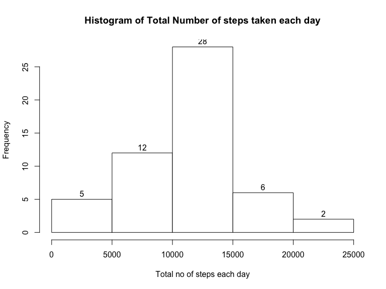
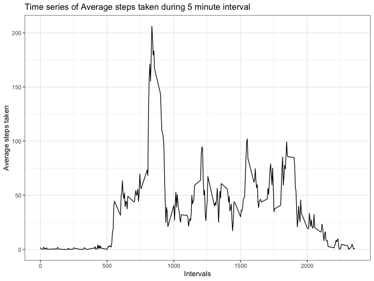
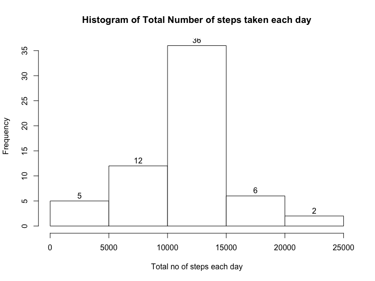
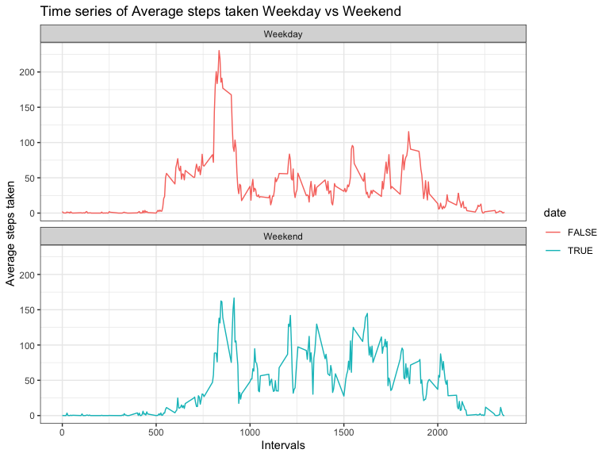

## Loading and preprocessing the data

Loading packages

    library(data.table)
    library(dplyr)
    library(ggplot2)

Load data with fread

    # load data into dt
    dt <- data.table::fread(unzip("repdata_data_activity.zip"),fill=TRUE)

    # Observing data
    head(dt)

    ##    steps       date interval
    ## 1:    NA 2012-10-01        0
    ## 2:    NA 2012-10-01        5
    ## 3:    NA 2012-10-01       10
    ## 4:    NA 2012-10-01       15
    ## 5:    NA 2012-10-01       20
    ## 6:    NA 2012-10-01       25

    str(dt)

    ## Classes 'data.table' and 'data.frame':   17568 obs. of  3 variables:
    ##  $ steps   : int  NA NA NA NA NA NA NA NA NA NA ...
    ##  $ date    : IDate, format: "2012-10-01" "2012-10-01" ...
    ##  $ interval: int  0 5 10 15 20 25 30 35 40 45 ...
    ##  - attr(*, ".internal.selfref")=<externalptr>

The date variable is a factor, we can ignore the NA Values, it is not
necessary to manipulate the data.

## What is mean total number of steps taken per day?

I group the data by date and calculate the sum of the steps

    steps_per_day <- dt %>%
        group_by(date) %>%
        summarize(sum_steps = sum(steps),  .groups = 'drop')

A histogram of total number of steps taken per day

    with(
        steps_per_day,
        hist(
            sum_steps,
            xlab = "Total no of steps each day",
            main = "Histogram of Total Number of steps taken each day",
            col = "white",
            border = "black",
            labels = TRUE
        )
    )

To calculate the mean and median, I use dplyr, with the summary function

    steps_per_day %>%
        filter(complete.cases(.)) %>%
        summarize(mean = mean(sum_steps), median = median(sum_steps))

    ## # A tibble: 1 × 2
    ##     mean median
    ##    <dbl>  <int>
    ## 1 10766.  10765

Mean Number of Steps Taken per Day = 1.076618910^{4} Median Number of
Steps Taken per Day = 10765

## What is the average daily activity pattern?

Make a time-series plot of the 5-minute interval and the average number
of steps taken, averaged acoss all days.

    mean_interval <- dt %>% group_by(interval) %>%
        na.omit() %>%
        summarize(avg_step = mean(steps), .groups = 'drop')

    ggplot(mean_interval, aes(interval, avg_step)) +
        geom_line() +
        labs(x = "Intervals", y = "Average steps taken") +
        ggtitle("Time series of Average steps taken during 5 minute interval") +
        theme_bw()

Which 5-minute interval across all days contain the maximum number of
steps

    mean_interval %>% filter(avg_step == max(avg_step))

    ## # A tibble: 1 × 2
    ##   interval avg_step
    ##      <int>    <dbl>
    ## 1      835     206.

the 5 minute interval number 835 contains the maximum number of steps

## Imputing missing values

Calculate and report the total number of missing values in the dataset.

    dt %>% summarise_all(~sum(is.na(.)))

    ##   steps date interval
    ## 1  2304    0        0

To fill in the missing values, I will use a for loop to loop through all
the rows and for the rows with missing values, an index variable will be
created to store the indices that match the intervals in the
mean\_interval data table, then I assign the average step values to the
missing ones in a new data table

    # create new data table
    complete_dt <- dt

    # loop over all rows
    for (i in 1:nrow(complete_dt)) {
        if(is.na(complete_dt$steps[i])) {
            # match indexes of new datatable interval with mean_interval
            index <- which(complete_dt$interval[i] == mean_interval$interval)
            # assign average step to NA at ith row of step column
            complete_dt$steps[i] <- mean_interval[index,]$avg_step
        }
    }

With the new data,I create a new histogram.

    # perform necessary transformation
    hist_complete_dt <- complete_dt %>%
        group_by(date) %>%
        summarize(sum_steps = sum(steps), .groups = 'drop')

    # plot histogram
    with(
        hist_complete_dt,
        hist(
            sum_steps,
            xlab = "Total no of steps each day",
            main = "Histogram of Total Number of steps taken each day",
            col = "white",
            border = "black",
            labels = TRUE
        )
    )

The mean and median.

    hist_complete_dt %>%
        summarize(mean = mean(sum_steps), median = median(sum_steps))

    ## # A tibble: 1 × 2
    ##     mean median
    ##    <dbl>  <dbl>
    ## 1 10766. 10766.

There is a difference of 0 in the mean steps of the two dataset. There
is a difference of -1.076381110^{4} in the median steps of the two
dataset. There is a difference of 8.612950910^{4} in the total steps of
the two dataset.

## Are there differences in activity patterns between weekdays and weekends?

Create a new factor variable in the dataset with two levels - “weekend”
and “weekday”

    library(chron) 
    w_complete_dt <- complete_dt %>%
        mutate(date = chron::is.weekend(date))

Make a panel plot containing a time-series plot of the 5-minute interval
and the average number of steps taken across all weekdays or weekends

    # transforming data for plotting
    w_timeseries <- w_complete_dt %>% group_by(date, interval) %>%
        summarize(avg_step = mean(steps), .groups = 'drop')

    # changing labels for more appropriate names
    labels <- as_labeller(c(`TRUE` = "Weekend", `FALSE` = "Weekday"))

    # plot time series with ggplot
    ggplot(w_timeseries, aes(interval, avg_step, color=date)) +
        geom_line() +
        facet_wrap(~date, nrow=2, labeller= labels)+
        labs(x = "Intervals", y = "Average steps taken") +
        ggtitle("Time series of Average steps taken Weekday vs Weekend") +
        theme_bw()

